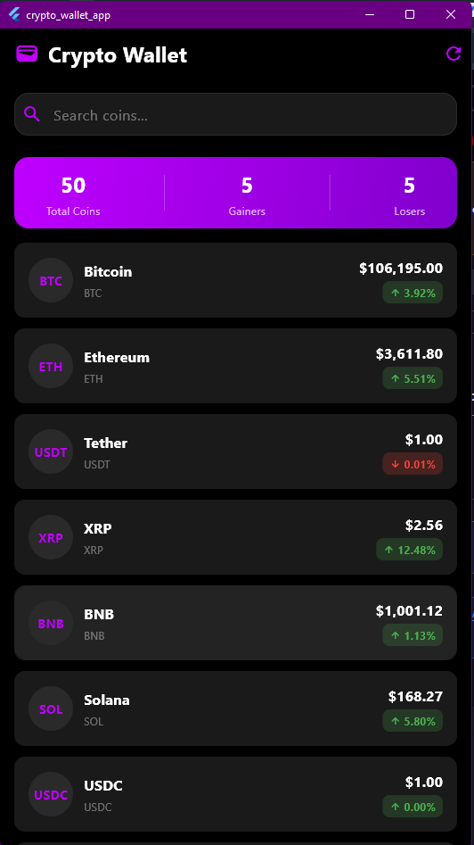
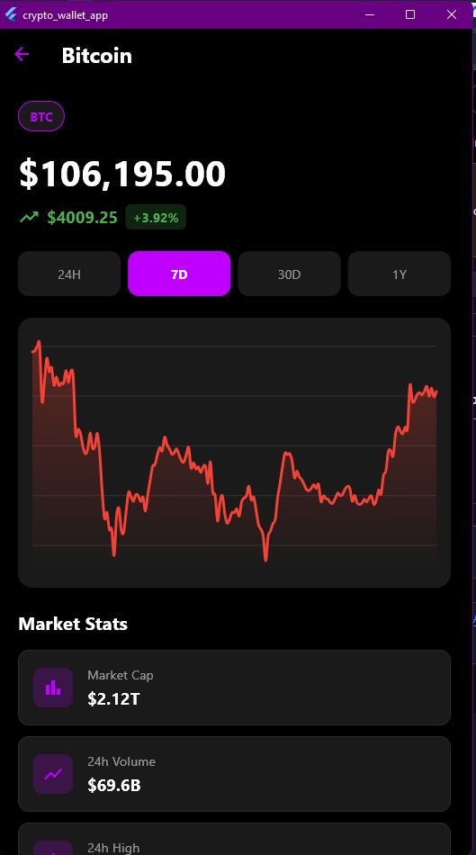

# 🪙 Crypto Wallet App

A beautiful, modern cryptocurrency tracking application built with Flutter. Features real-time price data, interactive charts, and a sleek dark theme with neon purple accents.


## 📱 Screenshots

[]


## ✨ Features

- 📊 **Real-time Cryptocurrency Prices** - Live data from CoinGecko API
- 📈 **Interactive Price Charts** - View price trends over 24H, 7D, 30D, and 1Y
- 🔍 **Search Functionality** - Quickly find any cryptocurrency
- 💫 **Beautiful UI** - Dark theme with neon purple accents
- 🔄 **Pull to Refresh** - Update coin prices with a simple swipe
- 📉 **Detailed Statistics** - Market cap, volume, 24h high/low, and more
- ⚡ **Smart Caching** - Reduces API calls and improves performance
- 🌐 **Offline Support** - Graceful error handling for network issues
- 🎨 **Modern Design** - Inspired by Dribbble and Behance designs

## 🚀 Getting Started

### Prerequisites

- Flutter SDK (>=3.0.0)
- Dart SDK (>=3.0.0)
- Android Studio / VS Code
- An Android device or emulator

## 🎥 Demo Video

[Watch Demo Video](https://drive.google.com/file/d/13iZ2plFqbviXOjg9P67OVwyGP6hh0Ym7/view?usp=sharing)

## 📱 Download APK

[Download APK (45.7MB)](https://drive.google.com/file/d/1r0KG7xqGIoFiADcA0t1KigN4GVTD7LkF/view?usp=sharing)


### Installation Instructions:
1. Download the APK file from the link above
2. On your Android device, go to Settings → Security
3. Enable "Install from Unknown Sources"
4. Open the downloaded APK file
5. Tap "Install"
6. Open the app and enjoy!

### Installation

1. **Clone the repository**
   ```bash
   git clone https://github.com/Uchedivine/crypto_wallet_app.git
   cd crypto_wallet_app
   ```

2. **Install dependencies**
   ```bash
   flutter pub get
   ```

3. **Run the app**
   ```bash
   flutter run
   ```

## 📦 Dependencies

```yaml
dependencies:
  flutter:
    sdk: flutter
  http: ^1.1.0              # API requests
  fl_chart: ^0.65.0         # Charts
  provider: ^6.1.1          # State management
  intl: ^0.18.1             # Formatting
  cached_network_image: ^3.3.0  # Image caching
  shimmer: ^3.0.0           # Loading effects
```

## 🏗️ Project Structure

```
lib/
├── main.dart                 # App entry point
├── models/
│   ├── coin_model.dart       # Coin data model
│   └── chart_data_model.dart # Chart data model
├── services/
│   └── api_service.dart      # API integration
├── providers/
│   └── coin_provider.dart    # State management
├── screens/
│   ├── home_screen.dart      # Main coins list
│   └── coin_detail_screen.dart # Coin details & chart
└── widgets/
    └── (reusable widgets)
```

## 🎨 Design Features

### Color Scheme
- **Primary Background**: Pure Black (#000000)
- **Card Background**: Dark Gray (#1A1A1A)
- **Accent Color**: Neon Purple (#BF00FF)
- **Border Color**: Subtle Gray (#2A2A2A)

### Key Components
- Custom coin cards with price indicators
- Smooth gradient effects
- Interactive time range selector
- Beautiful line charts with gradients
- Loading states with purple spinners
- Error states with retry buttons

## 🔌 API Integration

This app uses the [CoinGecko API](https://www.coingecko.com/en/api) (free tier) to fetch:
- List of top cryptocurrencies
- Real-time price data
- Historical price charts
- Market statistics

**Note**: The free API has a rate limit of ~30 calls per minute. The app implements smart caching to minimize API requests.

## 🛠️ Key Features Explained

### State Management (Provider)
- Centralized state management using Provider package
- Efficient data fetching and caching
- Automatic UI updates on data changes

### Error Handling
- Network error detection
- Rate limit handling with cached data fallback
- User-friendly error messages
- Retry functionality

### Performance Optimizations
- Chart data caching to reduce API calls
- Lazy loading of coin details
- Efficient list rendering with ListView.builder
- Image caching for coin logos

## 📱 Building APK

To build a release APK:

```bash
flutter build apk --release
```

The APK will be located at: `build/app/outputs/flutter-apk/app-release.apk`


## 📝 Setup Instructions for Testing

1. Download the APK from the releases section
2. Enable "Install from Unknown Sources" on your Android device
3. Install the APK
4. Open the app and enjoy tracking cryptocurrencies!

## 🐛 Known Issues

- CoinGecko free API has rate limits (30 calls/minute)
- Charts may show "Rate limit exceeded" if you switch between time periods too quickly
- Solution: Wait 1 minute or use cached data


## 🤝 Contributing

Contributions, issues, and feature requests are welcome!

## 📄 License

This project is licensed under the MIT License.

## 👨‍💻 Author

- GitHub: [@uchedivine](https://github.com/Uchedivine)
- LinkedIn: [Uchechukwu Asogwa](https://www.linkedin.com/in/uchechukwu-asogwa-3873b7209/)

## 🙏 Acknowledgments

- [CoinGecko](https://www.coingecko.com/) for the free API
- [Flutter](https://flutter.dev/) for the amazing framework
- [fl_chart](https://pub.dev/packages/fl_chart) for beautiful charts
- HNG Internship for the project opportunity

## 📞 Support

For support, email your@email.com or join our Slack channel.

---

**Built with ❤️ and Flutter**